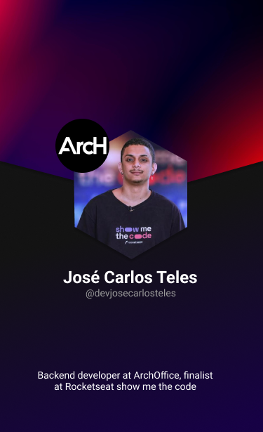

 
<strong>Olá sou ROOT.XYZ | SANDERS | J105B 🇧🇷, desenvolvedor de Kernels</strong>

 
<h1>Github Status</h1>
 <a href="https://www.github.com/SrRoot2022">
  
  

<h1>Contatos</h1>

 

<h1>Atividade</h1>
<!-- visitors count  -->

   
    

<!-- github workflow  -->

 

